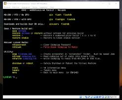

 

</a>
 

<h2 id="english">Tytera MD380 & MD390 Firmware made with KD4Z md380tools</h2>
  
This is our modified version of KD4Z md380tools firmware.
  
Why ? : Our version displays all regions and countrys correctly. :) (work in progress)
  
If something displays incorrectly, tell us and we will fix it right away (either in the database or in the software).
  
<li>
<a href="https://github.com/BM-Database/md380tools/blob/master/KD4Z%20Toolkit%20v4%20Tutorial%20v1.0d.pdf">KD4Z Toolkit v4 Tutorial v1.0d</a>
</li>
<li>
<a href="https://github.com/BM-Database/md380tools/raw/master/firmware-noGPS.bin">MD-380/390 no GPS</a>
</li>
<li>
<a href="https://github.com/BM-Database/md380tools/raw/master/firmware-GPS.bin">MD-380/390 with GPS</a>
</li>
<li>
<a href="https://github.com/BM-Database/md380tools/raw/master/firmware-OLD.bin">MD-380/390 old firmware</a>
</li>
